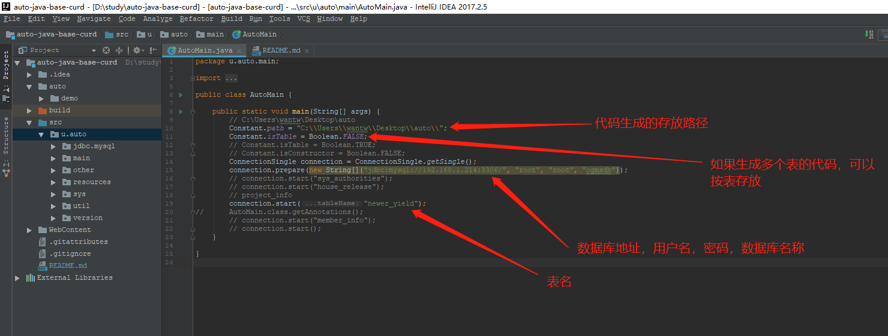
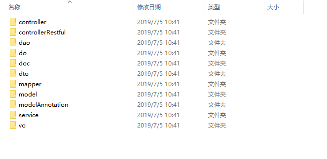
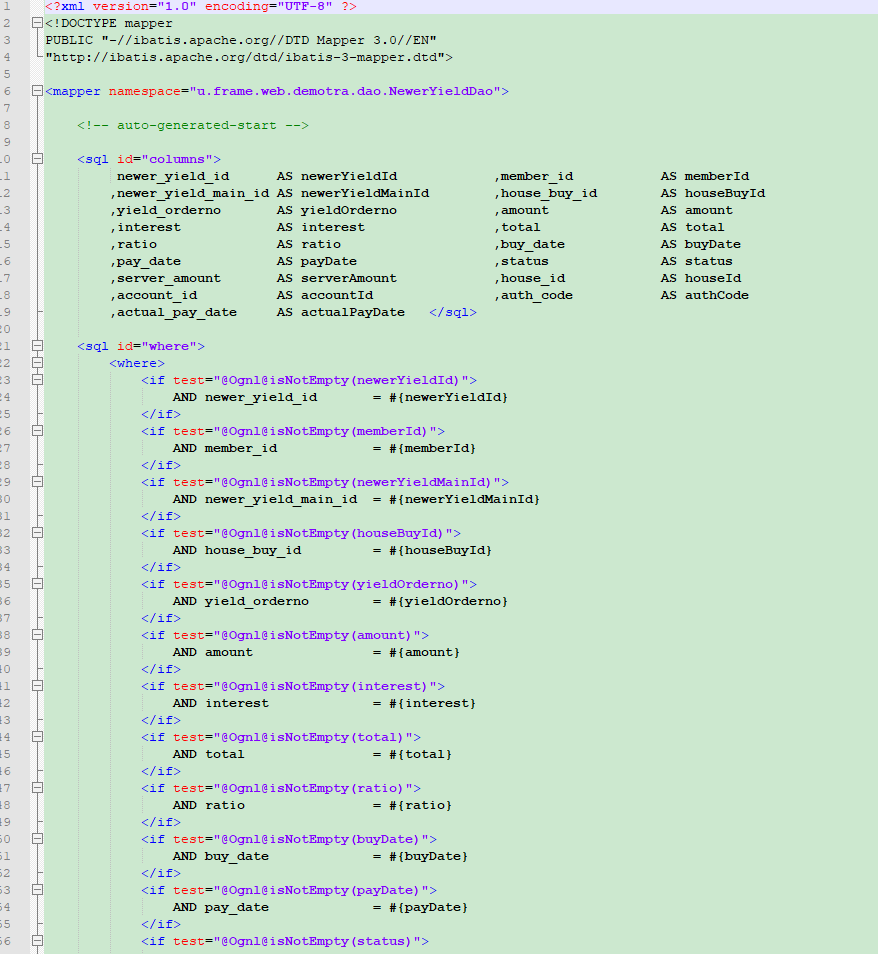
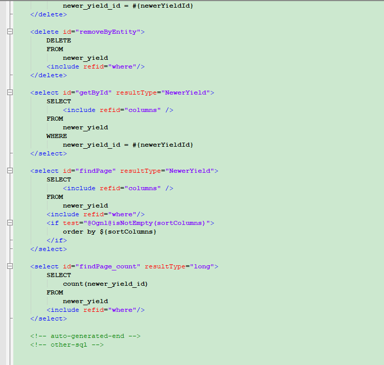

# auto-java-base

自动生成一些基础CURD的代码


#### CURD

作为一个资深的CURD工程师,总是写一些基础的代码,我实在看不下去了,
写了一个自动生成基础代码的工具,希望对大家有用

#### 下载项目

``` bash
导入到 eclipse 或者 idea

配置依赖 
WebContent/WEB-INF/lib

然后
到src/u/auto/main/AutoMain配置一些数据库参数

最后
运行
src/u/auto/main/AutoMain
就可以了

项目中的 auto.demo 我生成的一个 demo

诸位觉得有用,就可以下载下来,用用,代码,你可以自己修改一下,让生成的代码,更适应你现在的项目,
我维护这个项目很佛系

```

#### 以下是操作截图

#  


#### 以下生成的代码截图

#  
#  
#  

